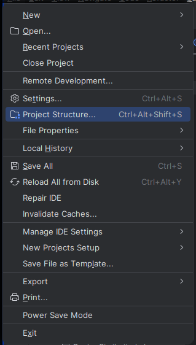

<h3 align="center"> Information Retrieval </h3>

<h4 align="center"> Assignment # 2 </h4>

Write a java code that:-

- Read 10 text files.
- Build the inverted index for those 10 file.
- get a query ( set of a number of words).
- compute the cosine similarity between each file and the query
- rank the 10 files according to the value of the cosin similarity

<ins> Hints:</ins>


```java

String result = "";
 String[] terms = phrase.split("\\W+");
 int len = words.length;
 double scores[] = new double[N]; // N= collection size (10 files N =10)
 //1 float Scores[N] = 0
 //2 Initialize Length[N]
 //3 for each query term t
 for (String term : terms) {
 //4 do calculate w t, q and fetch postings list for t
 term = term.toLowerCase();
 int tdf = index.get(term).doc_freq; // number of documents that contains the term
 int ttf = index.get(term).term_freq; //
 //4.a compute idf
 idf = log10(N / (double) tdf); // can be computed earlier
 //5 for each pair(doc_id, dtf ) in postings list
 //6 add the term score for (term/doc) to score of each doc
 scores[p.docId] += (1 + log10((double) p.dtf)) * idf);
 //Normalize for the length of the doc
 //7 Read the array Length[d]
 //8 for each d
 //9 do Scores[d] = Scores[d]/Length[d]
 //10 return Top K components of Scores[]

```

<h4 align="center"> Bonus Assignment </h4>

- [1st] download [**`jsoup`**](https://jsoup.org/packages/jsoup-1.16.1.jar) library
- [2nd] add the `library` to your project
- [3rd] adding library in [**`IntelliJ IDEA`**](https://www.jetbrains.com/idea/download/)
  - **`File`** -> **`Project Structure...(Ctrl+Alt+Shift+S)`** -> **`Libraries`** -> **`+`** -> **`Java`**
  - 


